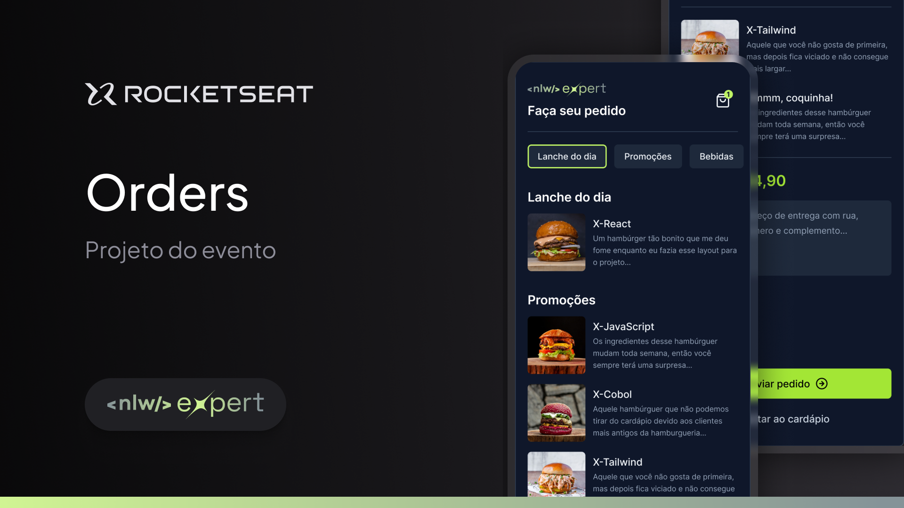

<p align='center'>
  
</p>



## 🗒️ Sobre o projeto
Aplicativo mobile de delivery de lanches desenvolvido durante a NLW Expert da Rocketseat. A aplicação permite ao usuário visualizar o cardápio organizado por categoria, os detalhes de cada lanche, adicionar e remover do carrinho e finalizar o pedido enviando-o por WhatsApp. 


## 🛠️ Tecnologias e ferrementas utilizadas

- [TypeScript](https://www.typescriptlang.org/)
- [React Native](https://reactnative.dev/)
- [Expo](https://expo.dev/)
- [React Navigation](https://reactnavigation.org/)
- [react-native-safe-area-context](https://github.com/th3rdwave/react-native-safe-area-context)
- [React Native Screens](https://github.com/software-mansion/react-native-screens)
- [React Native AsyncStorage](https://docs.expo.dev/versions/latest/sdk/async-storage/)
- [clsx](https://www.npmjs.com/package/clsx)
- [NativeWind](https://www.nativewind.dev/)
- [Zustand](https://docs.pmnd.rs/zustand/getting-started/introduction)
- [WhatsApp API](https://faq.whatsapp.com/5913398998672934/)

## 💻 Instalando e rodando o projeto localmente
#### Requisitos
- Node.js
- Gerenciador de pacotes
- Um dispositivo móvel ou simulador para rodar o aplicativo

```bash
# Passo 1: Clone este repositório
$ git clone https://github.com/welisonw/nlw14-expert-rn-orders.git


# Passo 2: Acessa a pasta do projeto
$ cd nlw14-expert-rn-orders


# Passo 3: Instale as dependências
## npm
$ npm install

## yarn
$ yarn install


# Passo 4: Inicie o projeto
## npm
$ npx expo start

## yarn
$ yarn expo start

# Escaneie o QR Code gerado com seu dispositivo móvel ou utilize um simulador para rodar o aplicativo.
```

## 📝 Licença
Esse projeto está sob a licença **MIT**. Veja o arquivo [LICENSE](LICENSE) para mais detalhes.
